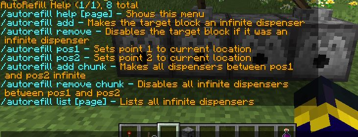

# AutoRefill
A simple lightweight and easy to use utility plugin for creating infinite capacity dispensers

# Installation Instructions:
1. Locate or create a folder in your Spigot server directory called ```plugins```
2. Download the Plugin JAR [here](https://github.com/LaGamma/AutoRefill/releases/tag/v1.0.1)
3. Put that JAR file in your server's ```plugins``` folder
4. Start up your server and begin using the commands below


